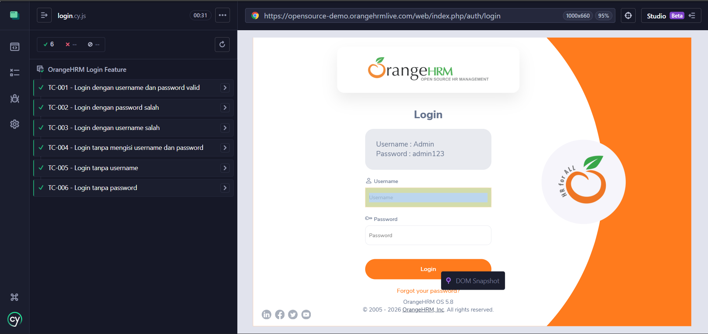
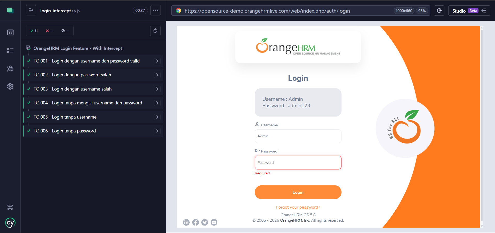

# OrangeHRM Login Automation - Cypress

## Deskripsi

Project ini berisi automation testing fitur login pada website OrangeHRM
menggunakan Cypress.

Website: https://opensource-demo.orangehrmlive.com

Semua test case berhasil dijalankan dengan hasil passing.

------------------------------------------------------------------------

## Author

Nama: Acep Handika Permana\
Role: Quality Assurance

------------------------------------------------------------------------

## Tools

-   Node.js
-   Cypress
-   JavaScript

------------------------------------------------------------------------

## Struktur Project

    orangehrm-cypress/
    ├── cypress/
    │   ├── e2e/login.cy.js
    │   ├── fixtures/
    │   └── support/
    ├── cypress.config.js
    ├── package.json
    └── README.md

------------------------------------------------------------------------

## Test Case

-   Login dengan data valid
-   Login dengan password salah
-   Login dengan username salah
-   Login tanpa username dan password
-   Login tanpa username
-   Login tanpa password

------------------------------------------------------------------------

## Screenshot

## Screenshot With Intercept

